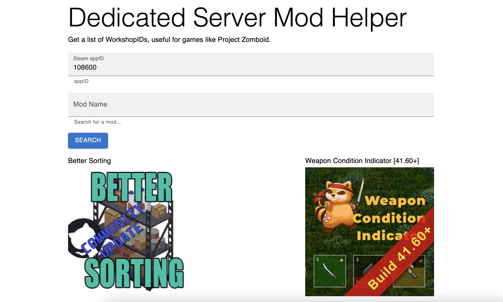
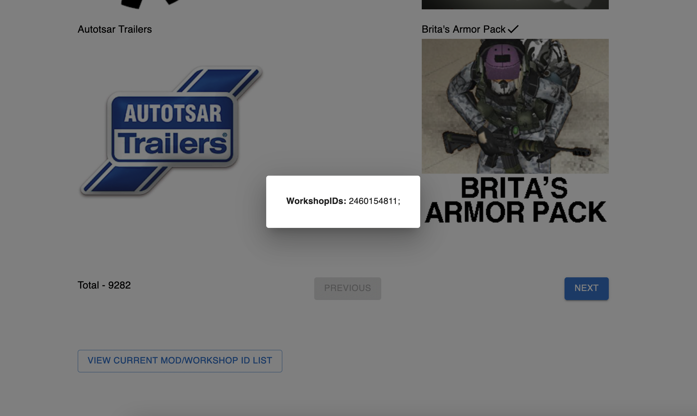

# Simple Steam Workshop Browser

Run this tool to automatically generate workshopIDs based on selected Workshop items. Eventually want to get modIDs but there doesn't seem to currently be a consistent way to get that without actually installing the workshop mod.

Requires an active Web API token which can be generated at https://steamcommunity.com/dev/apikey.

## Required env var
```
export NEXT_PUBLIC_STEAM_API_KEY=STEAM_API_KEY
```

# Install
```javascript
yarn
```

# Running
```
yarn dev
```



